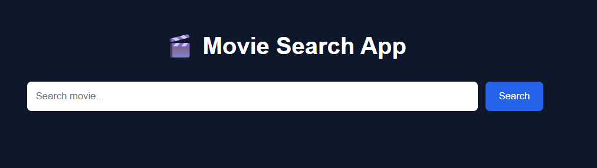
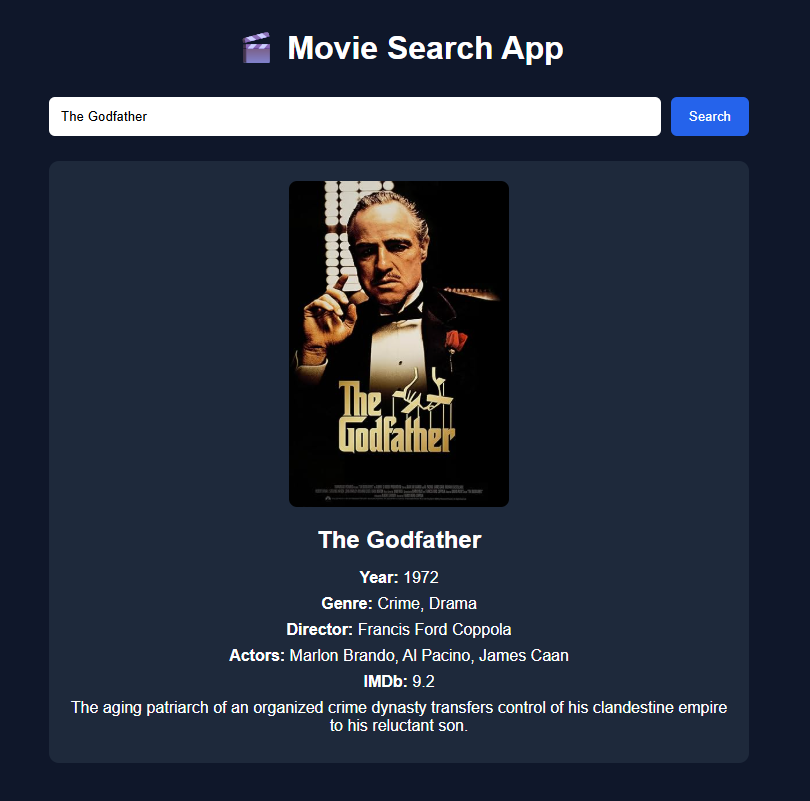

# 🎬 Movie Search App


A simple Movie Search App built using HTML, CSS and JavaScript.

---

## Features

- Search any movie
- Movie Poster
- Movie Plot
- Genre
- Director
- IMDb Rating
- Responsive UI
- Loading Indicator
- Error Handling
- Enter Key Support

---

## Tech Stack

- HTML5
- CSS3
- JavaScript (ES6)
- OMDb API

---

## Installation

Clone the repository.

```bash
git clone https://github.com/ajinkya029/Movie-Search-App.git
```

Open the project.

Replace

```javascript
const API_KEY = "YOUR_API_KEY";
```

with your OMDb API Key.

Run

```
index.html
```

---

## Project Structure

```

movie-search-app/
│
├── index.html              # Main HTML page
├── style.css               # Styling
├── script.js               # JavaScript logic
├── README.md               # Project documentation
└── screenshots/
    ├── home.png            # Home page screenshot
    ├── search-results.png  # Search results screenshot

```

---

## Screenshots

### Home




### Search Result



---

## Future Improvements

- Dark/Light Theme
- Search Suggestions
- Trending Movies
- Pagination
- Favorites
- Local Storage
- Watchlist
- Multiple Results
- Modal Popup

---

## Author

**Ajinkya Dhatrak**
